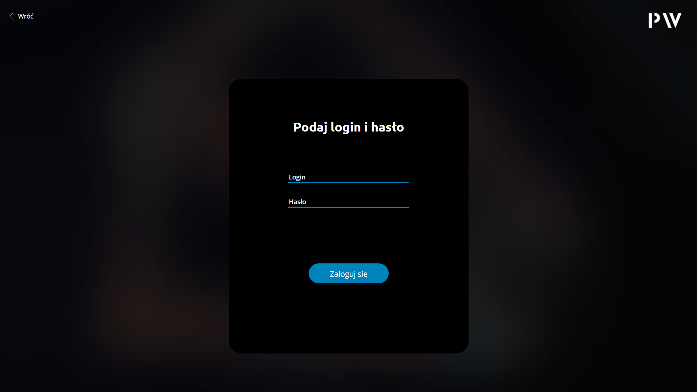
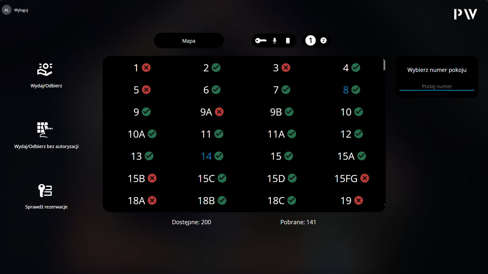
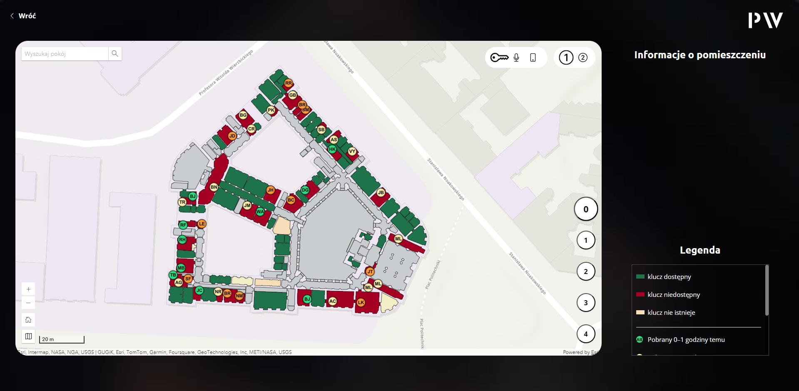
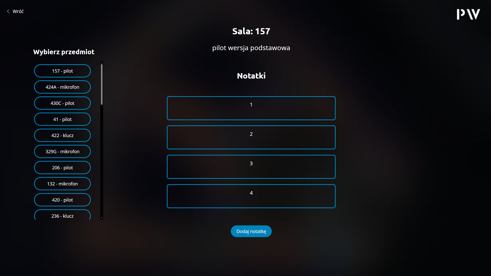
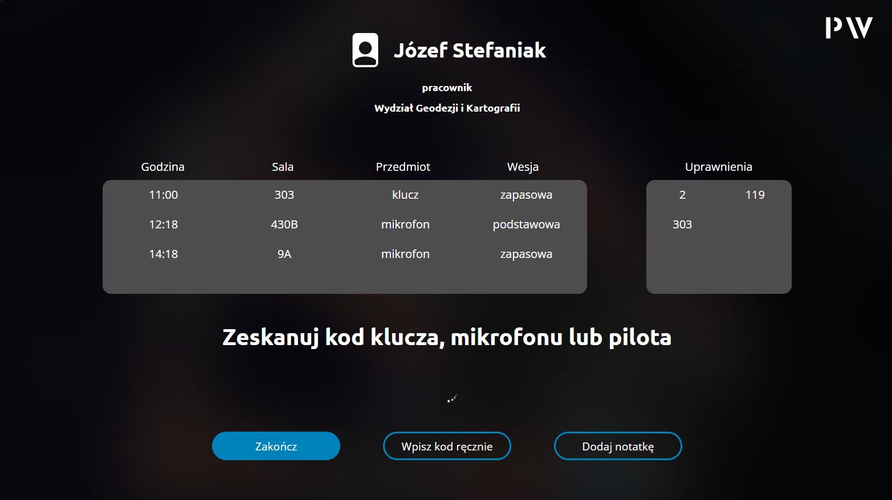

# [Introduction](#introduction)
A web application for managing keys and multimedia equipment in the Main Building of Warsaw University of Technology.

# [Features](#features)

- Key and Multimedia Equipment Management: Efficiently manage the allocation and tracking of keys and multimedia equipment.

- Item-Specific Notes: Add detailed notes for individual items, keeping all relevant information organized.

- Unauthorized Employee Registration: Facilitate the addition of new, unauthorized employees into the system.

-  Warsaw University of Technology Main Building Map: An interactive map displaying room availability and functionalities within the Main Building of Warsaw University of Technology.

- Room Reservation Inquiry: Check the reservation status for specific rooms or halls.

# [Requirements](#requirements)


## To run and develop this application, you need the following installed:

- [Node.js](https://nodejs.org/) (recommended version: >=16.x)
- [npm](https://www.npmjs.com/) (comes with Node.js)
- Modern web browser (for development and testing)

## Installing Dependencies

Before running the app, install all necessary packages:
```
npm install
```
## Running the Application

### Start development server with hot-reload:
```
npm run serve
```
### Build the app for production:
```
npm run build
```
## Additional Notes
- This project uses Vue CLI. You can customize configuration by editing `vue.config.js` or checking the [Vue CLI documentation](https://cli.vuejs.org/config/).
- All runtime and build-time dependencies are listed in `package.json`. If you're sharing the project, make sure to include this file.

# [Backend API](#backend)
This application requires a backend server to function correctly.

- The frontend communicates with a REST API.
- Default API URL: `http://localhost:8000` (configurable in environment files if applicable).
- The backend handles logic related to authentication, equipment data, and room reservations.

⚠️ **Note:** The backend currently does not have a connected database. This means some features (like data persistence) may not work as expected.

Link to backend's repository: https://github.com/20Julia02/Keys

# [Screenshots](#screenshots)
### Login Screen
A simple login form for authorized employees



### Main Screen
Overview of currently allocated keys



### Main Building Map
Interactive map of the Main Building of Warsaw University of Technology with legend.



### Item notes
view displays notes related to a specific room or item, allowing users to review existing entries and add new ones, such as key handover details or technical remarks.



### Main Process Screen
This view displays the items currently assigned to the user, allows adding keys for checkout, shows the user's room access permissions, and provides access to the note-adding interface.

